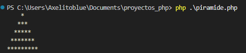
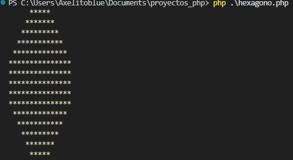

# Proyectos de PHP

**Mis proyectos de php** son dos programas simples que su funcion de los 2 programas uno es 
dibujar una piramide de 5x5 y el otro un hexagono de 5x5

# Capturas de los programas

**Piramide de 5x5**

